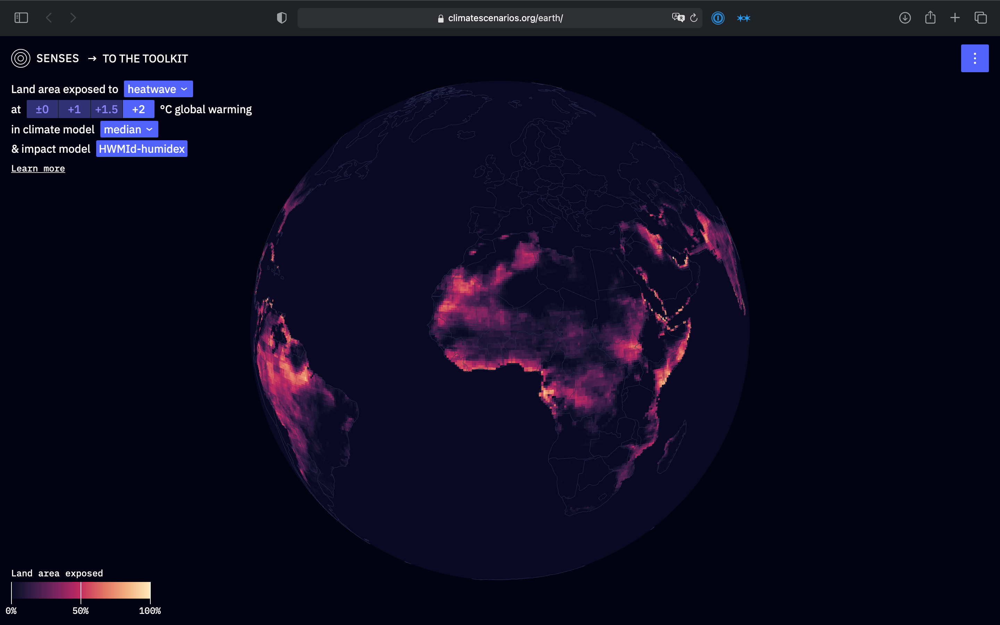

# earth

An explorative interface for spatial extreme events data



## License

The source code is licensed under the [ISC license](LICENSE.md). Text and graphics are licensed under [Attribution-ShareAlike 4.0 International](https://creativecommons.org/licenses/by-sa/4.0/). For licensing information on datasets please refer to the data sources section. Exceptions are listed below on a per-file basis.

## Data Soucres

Data sources and if applicable licenses are listed below on a per-file basis.

- `preprocessing/data/extreme-events/*` `public/grids/*` `src/assets/data/grids.json` Source: [Lange, S., Volkholz, J., Geiger, T., Zhao, F., Vega, I., Veldkamp, T., et al. (2020). Projecting exposure to extreme climate impact events across six event categories and three spatial scales. Earth's Future, 8, e2020EF001616. Accepted Author Manuscript. https://doi.org/10.1029/2020EF001616](https://agupubs.onlinelibrary.wiley.com/doi/abs/10.1029/2020EF001616); [CC BY 4.0](https://creativecommons.org/licenses/by/4.0/)
- `src/assets/data/world.json` Source: [Natural Earth](https://www.naturalearthdata.com); [Public Domain](https://www.naturalearthdata.com/about/terms-of-use/)

## Development

### Project setup
```
npm install
```

### Compiles and hot-reloads for development
```
npm run serve
```

### Compiles and minifies for production
```
npm run build
```

### Run your tests
```
npm run test
```

### Lints and fixes files
```
npm run lint
```

### Customize configuration
See [Configuration Reference](https://cli.vuejs.org/config/).
